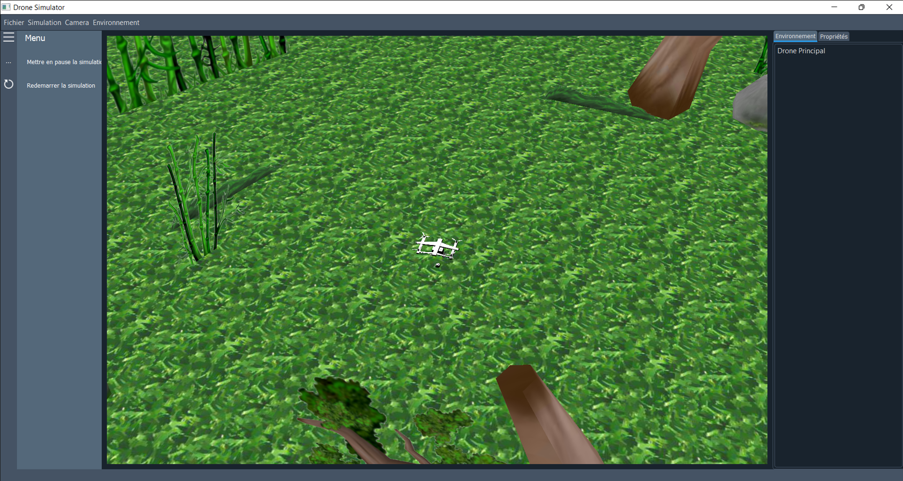

# Cam Control Drone
## Introduction
Ceci est un projet de pilotage de Drone virtuel utilisant un camera. Dans ce projet, 
je met en pratique différente compétence comme le dévéloppement d'application en `python` utilisation `QT Framework` comme
bibliothèque d'interface graphique par l'intermediaire du library ``PyQT`` . 

A part ``QT``, ce projet utilise `Pandas 3D` pour simuler l'environnement dans laquelle se trouve le Drone.

Le Drone en question evolue dans un environnement multi-agent, dans lequel, l'utilisateur peut ajouter
d'autre drone, les autres drones seront commandés par le premier. Ensemble il forme un système muti-agent autonome, se coordonant entre eux.
le tout commander par une intéraction visuelle humaine (Pour cette version actuelle on utilise le paume de la main).

## Architechture
L'architechture du projet se divise comme suit:
1. ``/gui`` : Dans ce dossier se trouve l'interface graphique sous format requise par `QT`.
2. ``/images`` : Contient les icones et autres images réquises par le projet.
3. ``/model`` : Modèle d'objet **3D** nécéssaire à l'environnement de simulation.
4. ``/tools`` : Contiennent des fonctions utilent pour le code principale comme le controlleur par camera.
5. ``main.py`` : Point d'entrée de l'application.

## Aperçu

